# AWS Connection Tracking System

## Overview
This project implements an automated system for processing and analyzing network connection logs using AWS services. It provides a scalable architecture for ingesting, processing, and querying connection tracking data using AWS Glue, Lambda, S3, and Athena.

## Architecture

```mermaid
flowchart TD
    User((User)) -->|Upload tar.gz| S3_1[S3 compressed/]
    
    subgraph S3 [S3 Bucket legal-requests]
        S3_1 -->|Event| Lambda1
        S3_2[S3 scripts/]
        S3_3[S3 parquet/]
        S3_4[S3 athena-results/]
    end

    Lambda1[Lambda trigger_glue] -->|Start| Glue1[Glue Job process_logs]
    S3_2 -.->|Script Source| Glue1
    Glue1 -->|Write| S3_3
    
    Glue1 -->|Job Complete| EventBridge[EventBridge Rule]
    EventBridge -->|Trigger| Lambda2[Lambda start_crawler]
    Lambda2 -->|Start| Crawler[Glue Crawler]
    
    Crawler -->|Update| GlueDB[(Glue Database)]
    GlueDB -->|Query| Athena[Athena]
    Athena -->|Results| S3_4

    style S3 fill:#FF9900,stroke:#FF9900,stroke-width:2px
    style Glue1 fill:#6B3A9E,stroke:#6B3A9E
    style Crawler fill:#6B3A9E,stroke:#6B3A9E
    style GlueDB fill:#3B48CC,stroke:#3B48CC
    style Lambda1 fill:#FF9900,stroke:#FF9900
    style Lambda2 fill:#FF9900,stroke:#FF9900
    style Athena fill:#232F3E,stroke:#232F3E
    style EventBridge fill:#FF4F8B,stroke:#FF4F8B
```


The system follows this workflow:
1. Connection log files (tar.gz) are uploaded to S3 in the `compressed/` folder
2. S3 event triggers Lambda function
3. Lambda initiates Glue job for processing
4. Glue job processes logs and stores them as Parquet files
5. On job completion, EventBridge triggers Glue crawler
6. Data becomes queryable through Athena

## Prerequisites
- AWS Account with appropriate permissions
- Terraform >= 1.7.0
- Python 3.10
- AWS CLI configured

## Infrastructure Components

### Storage (S3)
- Bucket: `legal-requests-${environment}`
- Folders:
  - `compressed/`: Input compressed log files
  - `raw/`: Extracted log files
  - `parquet/`: Processed Parquet files
  - `athena-results/`: Athena query results
  - `scripts/`: Glue job scripts
  - `temporary/`: Temporary processing files

### Data Processing
- **Glue Job**: Processes tar.gz files containing connection logs
  - Worker Type: G.1X
  - Number of Workers: 2
  - Python Version: 3
  - Glue Version: 4.0

### Data Catalog
- **Glue Database**: `connection_tracking_${environment}`
- **Glue Crawler**: Updates schema automatically after processing
- **Athena Workgroup**: `legal_requests_${environment}`

### Event Triggers
- S3 notifications for new .tar.gz files
- EventBridge rule for Glue job completion

## Security Features
- S3 bucket encryption (AES256)
- Public access blocked
- SSL-only access enforced
- IAM roles with least privilege
- Versioning enabled

## Data Format
The system processes connection logs with the following record types:

### New/Destroy Records
```
type,source_ip,dest_ip,timestamp,source_port,dest_port,protocol,nat_ip
```

### Session Termination Records
```
timestamp,[...],email,mac_address,private_ip
```

## Deployment

1. Initialize Terraform:
```bash
terraform init
```

2. Review planned changes:
```bash
terraform plan
```

3. Apply infrastructure:
```bash
terraform init
```

## Usage

1. Upload connection logs:
```bash
aws s3 cp connection_logs.tar.gz s3://legal-requests-${environment}/compressed/
```

2. Query processed data in Athena:
```sql
SELECT * FROM connection_tracking_${environment}.connection_logs
WHERE type = 'New'
LIMIT 10;
```

## Monitoring
- CloudWatch Logs for Lambda functions
- Glue job metrics enabled
- S3 bucket versioning for audit trail

## Security Considerations
- All data is encrypted at rest
- SSL/TLS required for data transfer
- Least privilege IAM roles
- No public access to S3 bucket
- DynamoDB locking available for production environments

## Directory Structure
```
.
├── main.tf         # Main Terraform configuration
├── variables.tf    # Variable definitions
├── outputs.tf      # Output definitions
├── provider.tf     # Provider configuration
├── s3.tf          # S3 bucket configuration
└── src/
    ├── glue/
    │   └── process_logs.py
    └── lambda/
        ├── trigger_glue.py
        └── start_crawler.py
```

## Maintenance
- Regular updates of AWS provider
- Monitor Glue job performance
- Review and rotate IAM credentials
- Check Athena query optimization
